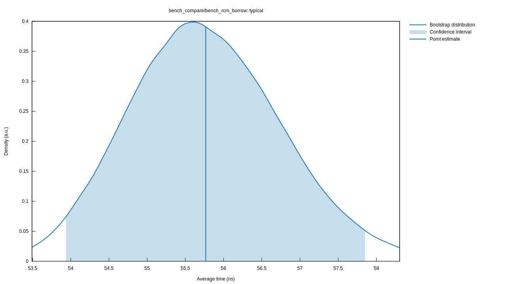
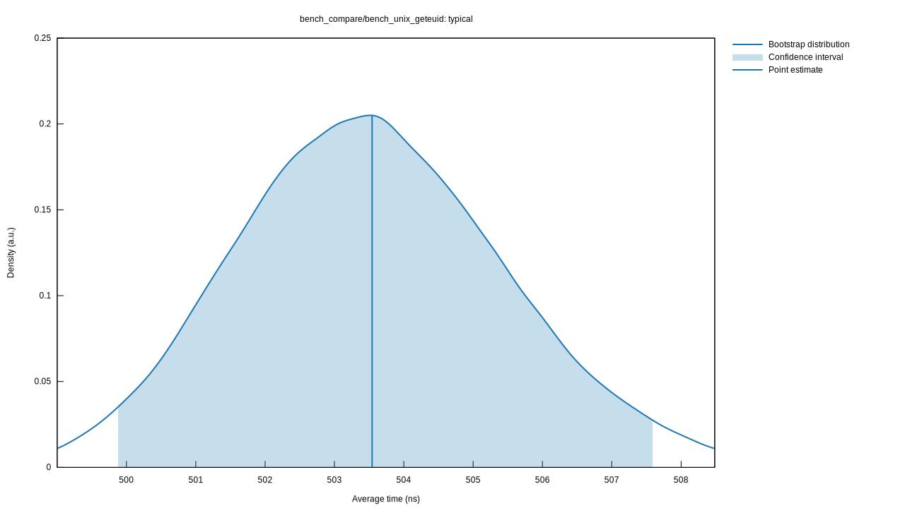

# std-ownership

[](https://github.com/Rhodes-OS/std-ownership/actions/workflows/rust.yml)
[](https://github.com/Rhodes-OS/std-ownership)
[](https://github.com/Rhodes-OS/std-ownership/actions/workflows/benches.yml)
[](https://discord.gg/XDvtrvxjKS)

An ownership model that is used to replace the Ring in Linux. **It's 10x faster than Ring in Syscall.**

## Overview
The ownership system allows users to customize safety checks to guarantee system and application security.

## Quick Start
In the `examples` module, you can run
```shell
cargo run --example ownership
```

## API
If you'd like to customize checks to forbid other applications from directly accessing "mysql.ibd", you can implement `trait Resource` for `MySQL` like below:
```rust
#[derive(Debug, Clone, Copy)]
pub struct MySQL<'a> {
    sys_files: &'a str,
    disk: Disk
}

impl<'a> MySQL<'a> {
    #[must_use]
    pub fn new() -> Self {
        Self { 
            sys_files: "mysql.ibd",
            disk: Disk::new(1024)
        }
    }

    #[inline]
    pub fn sys_files(&self) -> &'a str {
        &self.sys_files
    }

    #[inline]
    pub fn disk(&self) -> Disk {
        self.disk
    }
}

impl<'a> Resource for MySQL<'a> {
    #[inline]
    fn id(&self) -> u8 {
        3 //it will be replaced with auto id
    }

    #[inline]
    fn check(&self, table_name: &[u8]) -> bool {
        if !self.disk().check(table_name) {
            return false;
        }
        for file in self.sys_files().split(',').collect::<Vec<&str>>() {
            if file == str::from_utf8(table_name).unwrap() {
                return false;
            }
        }
        true
    }
}
```

## Performance

### 1w Concurrency

It's surprising! The ownership model is 10x faster than Ring in Syscall.

#### Ownership Borrow:
[](benches/typical_ownership.svg)

#### Geteuid(Syscall):
[](benches/typical_geteuid.svg)

