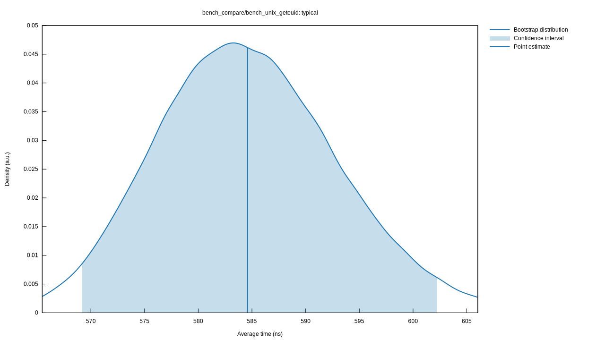

# std-ownership
An ownership model that is used to replace the system call in Linux.
## Benchmark

### 1w Concurrency

It's surprising! The ownership model is 10x faster than syscall.

#### Ownership Borrow:

#### Geteuid(Syscall):

